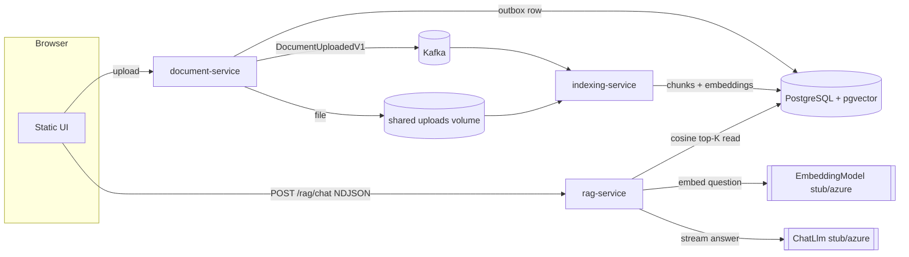

# Knowledge Platform

Knowledge Platform is organized as a monorepo with independently runnable services.
A reviewer can start everything with a single `docker compose` command, open a
browser, upload a document, and ask a natural-language question to get a streamed,
source-attributed answer — fully offline, with stub LLM and stub embeddings (no
API keys). A real Azure OpenAI provider can be dropped in by changing only
configuration.

Implemented services:

- `document-service/` — accepts documents, stores them on local disk, persists
  metadata in PostgreSQL, and writes an outbox event in the same transaction so
  Kafka publication stays asynchronous.
- `indexing-service/` — consumes `DocumentUploadedV1` from Kafka, reads files from
  shared storage, extracts text (PDFBox), chunks content, generates embeddings, and
  persists chunk records with vectors in PostgreSQL (pgvector).
- `rag-service/` — the RAG pipeline: embeds a question, runs a pgvector similarity
  search over indexed chunks, assembles an LLM context, and streams a
  source-attributed answer as NDJSON. Reactive (Spring WebFlux).
- `ui/` — a single static demo page served by nginx, which also reverse-proxies the
  APIs so the browser talks to one origin (no CORS).

## Architecture

- Spring Boot 4.1, Java 25, Lombok
- PostgreSQL (pgvector) + Liquibase (each service owns its schema)
- Apache Kafka (transactional outbox → at-least-once)
- Spring AI seams for embeddings + LLM (stub by default, Azure OpenAI placeholder)
- Local file storage shared between document- and indexing-service
- Actuator health endpoints; demo-grade Spring Security (role-based)

## End-to-end flow



## Run the demo

Boot the whole platform (builds images on first run):

```bash
docker compose -f compose.full.yaml up --build
```

Then:

1. Open the UI at <http://localhost:8088>.
2. Select the **admin** demo user (top-right) and **upload** a `.txt`, `.md`, or
   `.pdf` document.
3. Wait a few seconds for indexing (Kafka → embeddings → pgvector).
4. Type a question and click **Ask**. The answer streams token-by-token; the right
   panel shows the retrieved **sources** (document id, chunk index, score, snippet)
   and the **timings** (embedding / retrieval / llm / total).

All providers default to offline stubs, so no secrets are required.

Ports: UI `8088`, document-service `8080`, rag-service `8082`, PostgreSQL `5432`,
Kafka `19092` (host).

### Demo users and roles

Credentials are intentionally visible — they are demo-only, not production auth.

| Username | Password | Role         | Can do                                            |
|----------|----------|--------------|---------------------------------------------------|
| `admin`  | `admin`  | `ROLE_ADMIN` | Upload documents **and** chat / query RAG         |
| `user`   | `user`   | `ROLE_USER`  | Chat / query RAG and read own conversations       |

Authorization is enforced by real authentication: the caller's username becomes the
conversation owner (there is no client-supplied `X-User-Id` header).

- `POST /api/v1/documents` → `ROLE_ADMIN`
- `/api/v1/rag/**` → authenticated (`ROLE_USER` or `ROLE_ADMIN`)
- actuator health/info and the UI static assets → permit all

### Swap in Azure OpenAI (no keys committed)

The embedding and LLM seams select a provider via a single property each, defaulting
to `stub`. To use Azure OpenAI, set the provider to `azure` and supply endpoint/key
via environment variables (empty by default — nothing is committed):

```bash
EMBEDDING_PROVIDER=azure \
LLM_PROVIDER=azure \
AZURE_OPENAI_ENDPOINT=https://<resource>.openai.azure.com \
AZURE_OPENAI_API_KEY=<key> \
AZURE_OPENAI_CHAT_DEPLOYMENT=<chat-deployment> \
AZURE_OPENAI_EMBEDDING_DEPLOYMENT=<embedding-deployment> \
docker compose -f compose.full.yaml up
```

No image rebuild is needed — the Azure clients are already wired and gated by
`knowledge-platform.{embedding,llm}.provider=azure`.

### Service boundary trade-off (read-only chunk access)

`rag-service` reads the `indexing_service.document_chunks` table (owned by
indexing-service) directly for vector retrieval. This is a deliberate, documented,
**read-only** coupling for the demo — rag-service never writes to, migrates, or owns
that table, and both services pin the same 768-dim / cosine settings.

The clean-architecture alternative (a seam left as a TODO): indexing-service could
expose a `/search` API or publish a read model that rag-service consumes, removing
the shared-table read. Not built in this phase.

The shared **uploads** named volume mounted into both document- and indexing-service
is the one other piece of local coupling, called out in `compose.full.yaml`.

## Upload flow

1. Client uploads a multipart file to `POST /api/v1/documents`
2. The service validates content type and size
3. The file is stored on disk
4. `documents` and `outbox_events` are written in one PostgreSQL transaction
5. A background outbox publisher sends `DocumentUploadedV1` to Kafka

## Transactional outbox

The service does not publish Kafka messages inside the upload transaction. Instead, it stores an outbox row with the document data. A scheduled publisher later claims unpublished rows, sends them to Kafka, and sets `published_at` after success.

This gives at-least-once delivery. Consumers must be idempotent.

## Local development

### With Docker Compose

Start infrastructure from the monorepo root:

```bash
docker compose -f compose.yaml up -d
```

Run the Document Service from its own application directory:

```bash
cd document-service
../mvnw spring-boot:run
```

Run the Indexing Service from its own application directory:

```bash
cd indexing-service
../mvnw spring-boot:run
```

### Profiles

- default: application runtime settings
- `dev`: local Kafka bootstrap settings

### Embeddings (indexing-service)

The indexing service stores chunk embeddings in a pgvector column. The provider
is selected with `knowledge-platform.embedding.provider`:

- `stub` (default): deterministic, offline vectors — no external service or API keys.
- `ollama`: real embeddings via a local [Ollama](https://ollama.com) instance using Spring AI.
- `openai`: OpenAI embeddings (e.g. `text-embedding-3-small`) via Spring AI; cheap and RAG-ready.

To use Ollama locally:

```bash
ollama serve                     # starts Ollama at http://localhost:11434
ollama pull nomic-embed-text     # 768-dim embedding model
cd indexing-service
KNOWLEDGE_PLATFORM_EMBEDDING_PROVIDER=ollama ../mvnw spring-boot:run
```

To use OpenAI (no secrets are committed; supply the key via env):

```bash
cd indexing-service
KNOWLEDGE_PLATFORM_EMBEDDING_PROVIDER=openai OPENAI_API_KEY=sk-... ../mvnw spring-boot:run
```

`text-embedding-3-small` is truncated to 768 dims (Matryoshka) to match the column.

`knowledge-platform.embedding.dimensions` (768) must match both the selected
model and the `document_chunks.embedding` pgvector column.

## API example

```bash
curl -X POST http://localhost:8080/api/v1/documents \
  -F "file=@architecture.pdf;type=application/pdf"
```

Response: `202 Accepted`

```json
{
  "id": "uuid",
  "fileName": "architecture.pdf",
  "status": "UPLOADED",
  "createdAt": "2026-07-29T..."
}
```

## Database

### `documents`

- `id`
- `file_name`
- `content_type`
- `size`
- `status`
- `storage_key`
- `created_at`
- `updated_at`
- `version`

### `outbox_events`

- `id`
- `aggregate_id`
- `aggregate_type`
- `event_type`
- `payload`
- `created_at`
- `published_at`
- `claimed_by`
- `claimed_until`
- `attempts`

## Kafka topic

- Topic: `knowledge.documents.v1`
- Key: `documentId`
- Payload: `DocumentUploadedV1`

## Testing

Run the full suite:

```bash
./mvnw test
```

Tests use Testcontainers for PostgreSQL (pgvector) and Kafka. Notable coverage:

- Retrieval ranking over seeded pgvector chunks (`rag-service`)
- Stub-embedding parity between indexing-service and rag-service (identical text →
  identical 768-dim vector, so query and stored embeddings are comparable)
- Stub LLM stream: stable answer, cited source ids, multiple DELTAs
- Chat NDJSON ordering (META → SOURCES → DELTA+ → DONE) and message persistence
- Security: unauthenticated → 401/403; `ROLE_USER` cannot upload; conversation
  ownership isolation

## Known limitations

- Demo-grade security only: in-memory users, HTTP Basic, visible demo passwords —
  not production auth (no OAuth2/OIDC, user store, or password hashing at scale)
- Providers default to offline stubs; Azure OpenAI is wired but off by default
- Outbox polling is intentionally simple and single-worker friendly
- No S3 storage, API gateway, hybrid/full-text search, or Kubernetes in this phase
- Consumers must tolerate duplicate events (at-least-once delivery)
- `rag-service` reads indexed chunks via a documented read-only table coupling
  (see "Service boundary trade-off")
