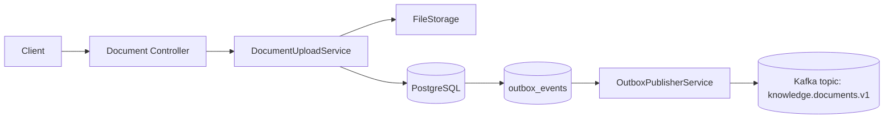
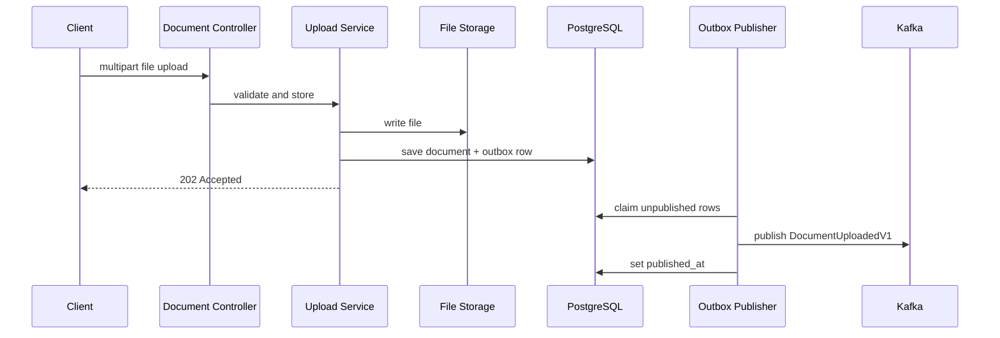
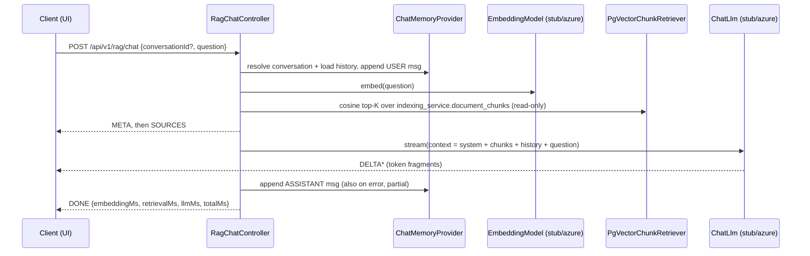

# Architecture

## Document Service

## Upload sequence

## RAG service

- `POST /api/v1/rag/chat` streams NDJSON; `POST /api/v1/rag/search` returns ranked
  sources without calling the LLM (retrieval is demonstrable and testable alone).
- Embedding and LLM are seams selected by `knowledge-platform.{embedding,llm}.provider`
  (`stub` default, `azure` placeholder). The stub LLM is deterministic and quotes the
  retrieved chunks with their source ids.
- rag-service reads `indexing_service.document_chunks` **read-only** for retrieval; it
  never writes or migrates that table. Clean-architecture alternative (an
  indexing-service `/search` API or published read model) is left as a TODO.

## Notes

- The upload transaction never publishes Kafka directly
- `published_at` marks successful publication
- The design accepts at-least-once delivery and duplicates
- `FileStorage` is intentionally abstract so S3 can replace local storage later
