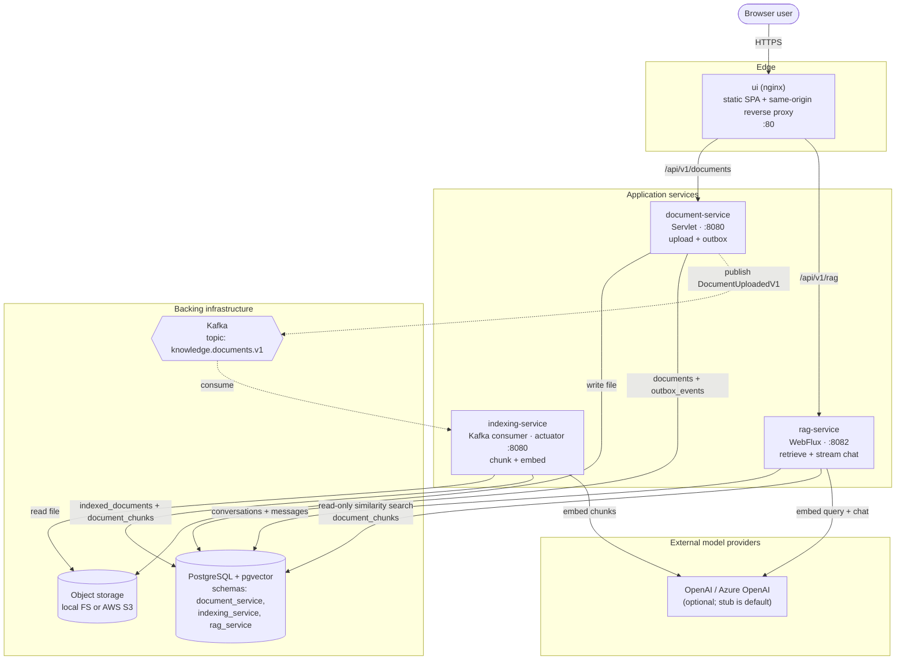
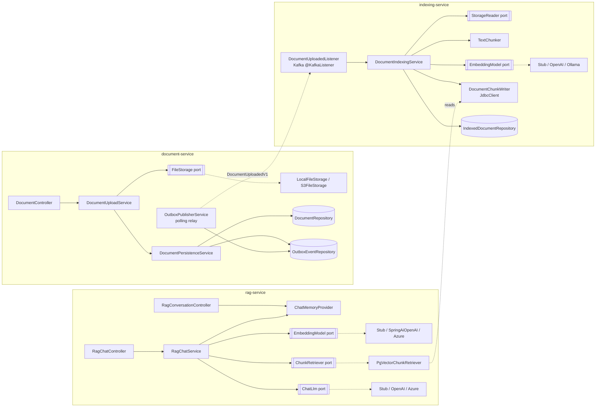
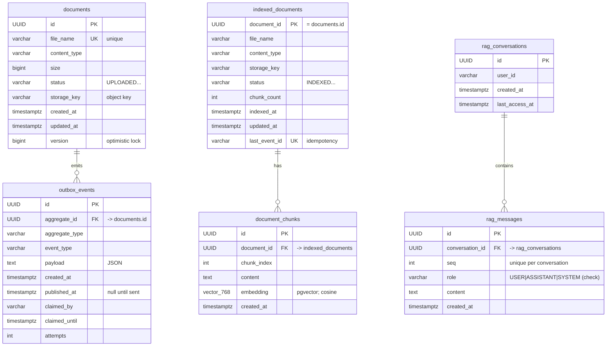
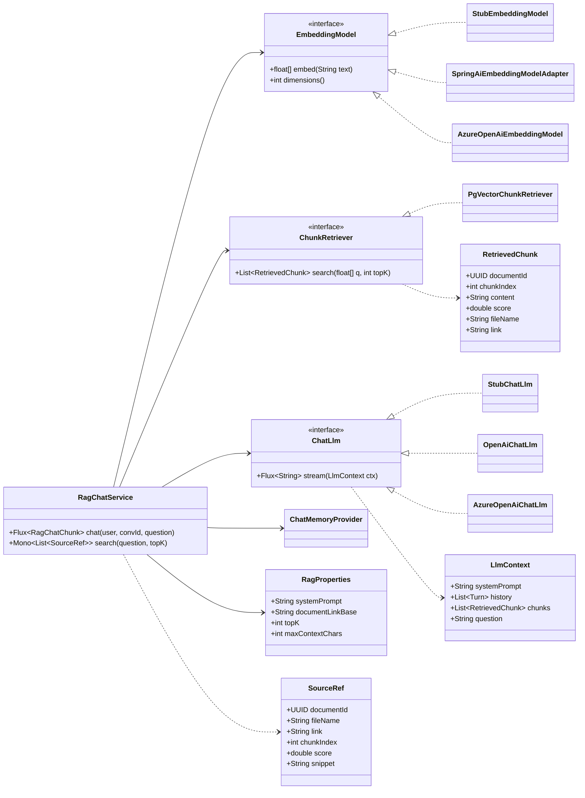
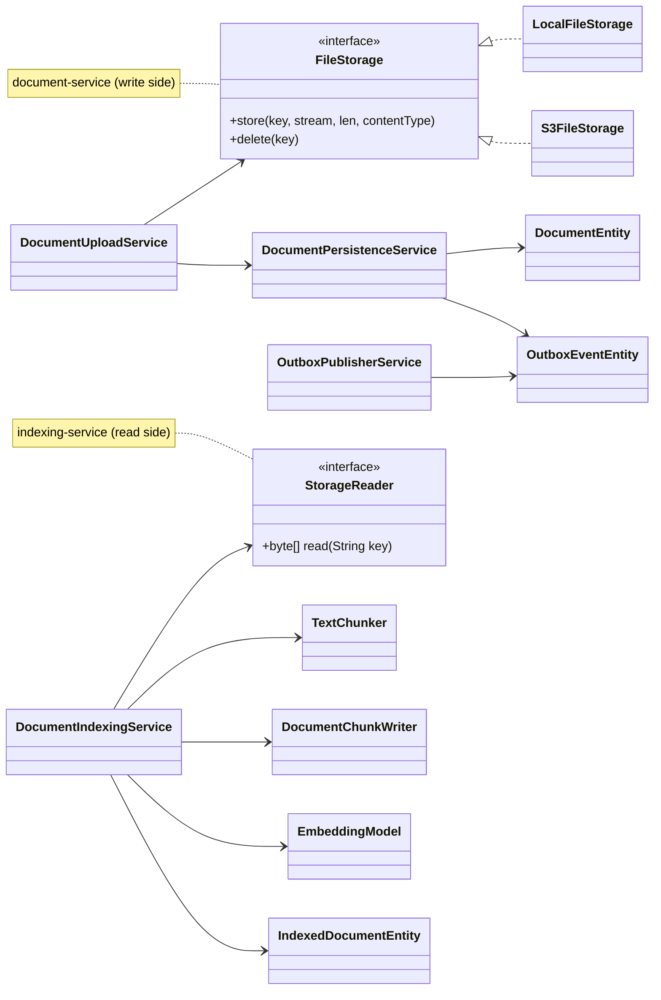
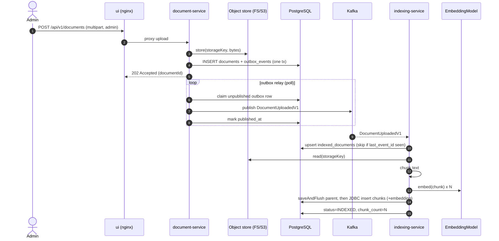
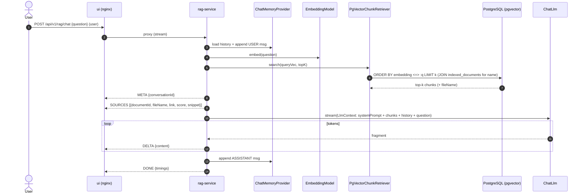

# Knowledge Platform — UML & Data Schema

Rendered diagrams (Mermaid) for the whole platform: system context, component
internals, database schema (ER), domain/provider class models, and the two core
runtime sequences. All diagrams render natively on GitHub and in most IDEs.

- [1. System context / deployment topology](#1-system-context--deployment-topology)
- [2. Component diagram (per service)](#2-component-diagram-per-service)
- [3. Database schema (ER)](#3-database-schema-er)
- [4. Class diagram — provider seams & domain](#4-class-diagram--provider-seams--domain)
- [5. Sequence — document upload → indexing](#5-sequence--document-upload--indexing)
- [6. Sequence — RAG chat](#6-sequence--rag-chat)

The platform is three independent Spring Boot services plus an nginx UI. Each
service **owns its own database schema** (no shared domain module); they
communicate only via a Kafka event and a read-only SQL view of chunks. Providers
(embedding / LLM) and object storage are pluggable behind interfaces.

---

## 1. System context / deployment topology

**Key boundary facts**

| Aspect | Detail |
|---|---|
| Sync coupling | None between services. Only Kafka (`document → indexing`) + a read-only chunk query (`rag → indexing_service.document_chunks`). |
| Storage sharing | `document-service` **writes**, `indexing-service` **reads** the same object store (shared FS locally; **S3** in prod). |
| Embedding parity | `indexing-service` (stored chunk vectors) and `rag-service` (query vector) MUST use the same provider/model/dimensions (`vector(768)`, cosine). |
| Providers | Selected by `knowledge-platform.{embedding,llm}.provider`; `stub` is the offline default. |

---

## 2. Component diagram (per service)

---

## 3. Database schema (ER)

One physical PostgreSQL database, three isolated schemas. `rag-service` reads
`indexing_service.document_chunks` for similarity search but never writes it.

**Cross-schema link (no DB-level FK — a deliberate service boundary):**
`indexed_documents.document_id` and `document_chunks.document_id` equal
`documents.id`; the value travels in the `DocumentUploadedV1` Kafka event.

**Notable constraints & indexes**

- `documents.file_name` UNIQUE (upsert-by-name); `idx_documents_status_created_at`.
- `outbox_events`: `idx_outbox_events_unpublished(published_at, claimed_until, created_at)` powers the polling relay's claim query.
- `indexed_documents.last_event_id` UNIQUE → **idempotent** consumption (duplicate Kafka delivery is a no-op).
- `document_chunks(document_id, chunk_index)` index; FK `ON DELETE CASCADE`.
- `rag_messages`: UNIQUE `(conversation_id, seq)` + CHECK on `role`.

---

## 4. Class diagram — provider seams & domain

The pluggable seams (Strategy pattern via `@ConditionalOnProperty`) are the heart
of the design.

---

## 5. Sequence — document upload → indexing

Transactional **outbox** guarantees the event is published iff the document row
is committed; the consumer is **idempotent** on `last_event_id`.

---

## 6. Sequence — RAG chat

Reactive streaming (WebFlux). Blocking JDBC/embedding/LLM calls run on the
bounded-elastic scheduler; the answer streams as `META → SOURCES → DELTA* → DONE`.

> The hardened default `systemPrompt` (see `RagProperties.DEFAULT_SYSTEM_PROMPT`)
> constrains the model to the provided context, forbids guessing, resists prompt
> injection from document/user content, and requires every answer to cite the
> source **document name + link**.
